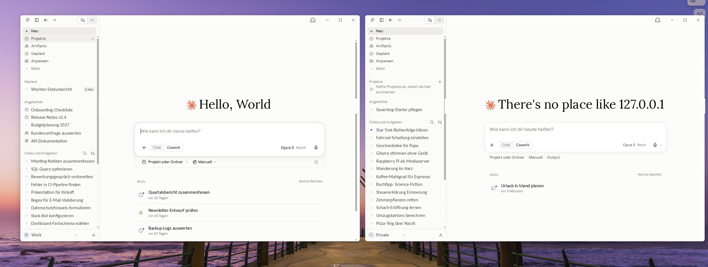

# Claude Multiverse

**Mehrere isolierte Claude-Desktop-Instanzen parallel unter Windows** — eine für die
Arbeit, eine privat, jede mit eigenem Konto, eigenen Connectors, MCP-Servern,
Einstellungen und Cowork-Umgebung. Kein Aus- und Einloggen, keine verlorenen
Cowork-Zeitpläne.

*English version: [README.md](README.md)*



## Installation

```powershell
irm https://raw.githubusercontent.com/normannormalmann/Claude-Multiverse/main/install.ps1 | iex
```

Danach:

```powershell
cmv new privat
```

Die geführte Einrichtung legt die Instanz an, erzeugt ein farbiges Icon zur Unterscheidung
in der Taskleiste, registriert eine Startaufgabe, damit keine UAC-Abfrage mehr kommt,
setzt eine Verknüpfung auf den Desktop und bietet an, die Instanz direkt zu starten.

Lieber klonen? `git clone`, dann `.\install.ps1` — gleiches Ergebnis, Dateien werden
kopiert statt heruntergeladen.

## Funktionsweise

Claude Desktop ist eine Electron-App. Electron kennt den Parameter `--user-data-dir`, der
das *gesamte* Datenverzeichnis umleitet: Auth-Token, `claude_desktop_config.json`,
VM-Bundles, Sitzungsdaten, Cowork-Disk-Images. Zwei Starts mit zwei Verzeichnissen
ergeben zwei vollständig unabhängige Apps aus einer Installation.

Die Windows-Besonderheit: Claude Desktop wird als **MSIX-Paket** ausgeliefert — sowohl aus
dem Microsoft Store als auch über `ClaudeSetup.exe`. MSIX-Apps werden über ihre
Paket-Identität aktiviert, und die üblichen Wege (Kachel, `shell:AppsFolder`) verschlucken
Startargumente. Der einzige Weg ist `Invoke-CommandInDesktopPackage`, das Paket-Identität
erhält *und* Argumente durchreicht — aber Administratorrechte braucht.

Damit das nicht bei jedem Start eine UAC-Abfrage bedeutet, legt `register` eine
Aufgabenplanung-Aufgabe mit höchsten Privilegien an. Verknüpfungen stoßen dann nur noch
die Aufgabe an. Für eigene geplante Aufgaben fragt Windows nicht erneut nach, also
starten die Instanzen ohne Dialog.

Klassische (Nicht-MSIX-)Installationen werden erkannt und direkt gestartet — ohne
Aufgabe, ohne Abfrage.

## Befehle

Nach der Installation liegt `cmv` im PATH. Ohne Argumente öffnet sich ein interaktives
Menü.

| Befehl | Wirkung |
| --- | --- |
| `cmv new [name]` | Geführte Einrichtung: Verzeichnis, Icon, Aufgabe, Verknüpfung, optional Start |
| `cmv launch <name>` | Instanz starten |
| `cmv stop <name>` | Instanz samt Hilfsprozessen beenden |
| `cmv shortcut <name>` | Verknüpfung. `-Label "…"`, `-Icon x.ico`, `-StartMenu`, `-Force` |
| `cmv register <name>` | Geplante Aufgabe, damit Starts ohne UAC laufen (nur MSIX) |
| `cmv unregister <name>` | Aufgabe entfernen |
| `cmv clone-config <von> <nach>` | Lokale MCP-Konfiguration kopieren; `default` = eingebaute Instanz |
| `cmv open <name>` | Datenordner der Instanz öffnen |
| `cmv list` | Instanzen mit Größe, Laufstatus, Verknüpfungs- und Aufgabenstatus |
| `cmv remove <name>` | Instanz samt Aufgabe, Verknüpfungen und Icon löschen |
| `cmv doctor` | Umgebung prüfen |

Instanzdaten liegen in `%USERPROFILE%\.claude-instances\<name>`, Icons in
`%USERPROFILE%\.claude-icons`. Das eingebaute Datenverzeichnis heißt immer `default` —
Claude normal starten, um es zu nutzen.

## Anmeldung in einer neuen Instanz

Hier stolpert jeder. Die Instanz ist isoliert, aber **der Login läuft im
Standardbrowser**, und der ist bereits mit dem anderen Konto angemeldet. Google oder
Microsoft winken den Login dann stumm durch, und die neue Instanz landet beim falschen
Konto.

1. Alle anderen Claude-Instanzen schließen, inklusive Tray-Icon. Der `claude://`-Callback
   geht an die Instanz, die das Protokoll zuletzt bedient hat.
2. Im Standardbrowser beim Identitätsanbieter abmelden oder die Kontoauswahl öffnen
   (`accounts.google.com/Logout` bei Google).
3. In der neuen Instanz anmelden.
4. Im Browser wieder das andere Konto anmelden. Sobald beide Konten dort bekannt sind,
   zeigt jeder weitere Login eine Auswahl statt stumm durchzuwinken.

Die Anmeldung per E-Mail-Code umgeht die Browser-Sitzung komplett. Das Skript zeigt
diesen Hinweis beim ersten Start jeder Instanz an.

## Was geteilt wird und was nicht

**Pro Instanz:** Konto, Unterhaltungen, Projekte, Connectors, MCP-Server, Einstellungen,
Cowork-Umgebung, `claude_desktop_config.json`.

**Geteilt:** die Claude-Desktop-Installation und damit ihre Version. Ein Update, alle
Instanzen.

`cmv clone-config default privat` kopiert die lokale MCP-Server-Konfiguration in eine neue
Instanz. Vorher werden die `env`-Schlüssel jedes Servers aufgelistet, damit sichtbar ist,
welche Zugangsdaten mitwandern; die bestehende Zielkonfiguration wird gesichert, und ohne
Bestätigung passiert nichts. Remote-Connectors hängen am Konto und werden *nicht*
kopiert — in der neuen Instanz erneut autorisieren.

Die eingebaute Instanz hält ihre Daten in `%APPDATA%\Claude`, auch bei der
MSIX-Installation — das Paket wird nicht virtualisiert. `cmv open default` öffnet den Ordner.

## Voraussetzungen

- Windows 10 oder 11
- Claude Desktop installiert
- Bei MSIX: ein Konto in der Administratorengruppe. `new` fragt einmal nach, um die
  Startaufgabe zu registrieren; danach starten Instanzen ohne Dialog. `stop` und `remove`
  fragen noch einmal, weil die Instanz erhöht läuft.
- PowerShell 5.1 oder 7 — das Skript wechselt selbst nach 5.1, weil dort die Module Appx
  und ScheduledTasks liegen.

## Fehlerbehebung

**`%LOCALAPPDATA%\AnthropicClaude` existiert nicht.** Du hast die MSIX-Installation; der
Pfad gehört zum alten klassischen Installer. `cmv doctor` zeigt, was erkannt wurde.

**Die neue Instanz hat mein bestehendes Konto geladen.** Browser-SSO hat die Sitzung
wiederverwendet. Siehe [Anmeldung](#anmeldung-in-einer-neuen-instanz).

**Es kommt immer noch eine UAC-Abfrage.** Keine Aufgabe registriert —
`cmv register <name>`, dann die Verknüpfung mit `cmv shortcut <name> -Force` neu anlegen.
`cmv list` zeigt den Aufgabenstatus.

**Die Verknüpfung zeigt das falsche Icon.** Windows cacht Icons hartnäckig.
`ie4uinit.exe -show` ausführen oder ab- und wieder anmelden.

**Beim Klick auf die Verknüpfung passiert nichts.** Ein fehlgeschlagener Start zeigt ein
Meldungsfenster und schreibt den Fehler nach `%USERPROFILE%\.claude-instances\last-error.log`.
`cmv launch <name>` im Terminal zeigt ihn live. Meist ist der Skriptpfad der Aufgabe
umgezogen — neu installieren oder `cmv register <name>` wiederholen.

**`Invoke-CommandInDesktopPackage` nicht gefunden.** Du bist in PowerShell 7 und der
automatische Wechsel ist fehlgeschlagen. Explizit ausführen:
`powershell.exe -File "$env:LOCALAPPDATA\ClaudeMultiverse\claude-multiverse.ps1" doctor`

## Bekannte Einschränkungen

- **Erhöhtes Token.** MSIX-Instanzen laufen aus einem erhöhten Kontext. Cowork in einer
  frischen Instanz testen, bevor du dich darauf verlässt. Auch das Beenden braucht
  Erhöhung, deshalb zeigen `stop` und `remove` einen UAC-Dialog.
- **Speicher.** Jede Instanz baut ihre eigene Cowork-Umgebung auf. Rechne mit mehreren GB —
  eine voll eingerichtete Instanz mit Cowork kann ~10 GB erreichen.
- **Langsamer Erststart**, während das leere Datenverzeichnis gefüllt wird.
- **Konsolenflackern.** Verknüpfungen zeigen kurz ein minimiertes Konsolenfenster; das ist
  `schtasks` beim Start. Kosmetisch.
- Ungetestet mit verwalteten Umgebungen (Intune, SCCM) und Standardbenutzerkonten.

## macOS und Linux

Nicht Teil dieses Repos. Für macOS nimm Philipp Strackers
[`claude_quick.sh`](https://gist.github.com/stracker-phil/9f84927a556632c7f9cc06663b534f14),
das dasselbe mit `open -n -a` erledigt und keine MSIX-Behandlung braucht. Für Linux gibt es
kein offizielles Claude Desktop. Pull Requests willkommen — aber nur für Code, den du
ausgeführt hast.

## Danksagung

Der `--user-data-dir`-Ansatz und die Analyse, warum Symlinks und Verzeichnistausch die
Cowork-VM brechen, stammen aus Philipp Strackers
[Running Multiple Claude Desktop Instances Side by Side](https://philippstracker.com/multiple-claude-instances/),
das auf [weidwonder/claude-desktop-multi-instance](https://github.com/weidwonder/claude-desktop-multi-instance)
aufbaut. Dieses Repo ist das Windows-Gegenstück inklusive der MSIX-Behandlung, die macOS
nicht braucht.

## Haftungsausschluss

Nicht mit Anthropic verbunden oder von Anthropic unterstützt. Claude und Claude Desktop
sind Produkte von Anthropic. Das Skript übergibt einen dokumentierten Electron-Parameter an
eine bereits installierte App — nicht unterstützte Nutzung, die bei Änderungen an Claude
Desktop angepasst werden muss.

## Lizenz

MIT
